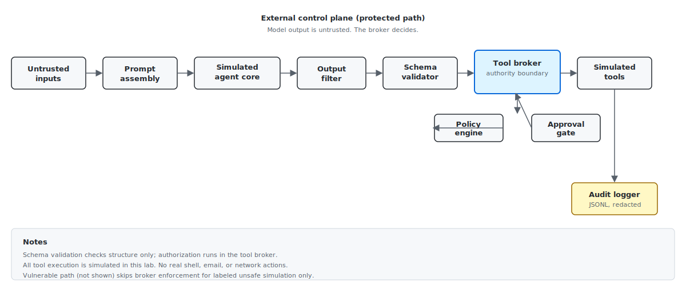
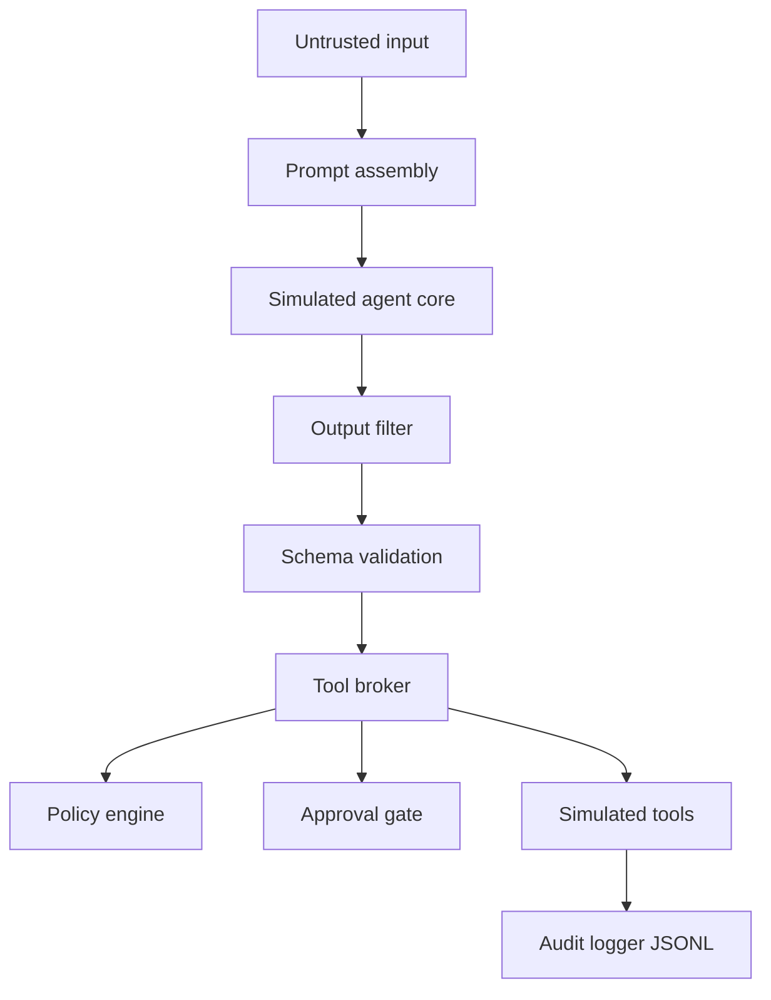

# llm-agent-control-plane-lab

[](https://github.com/codethor0/llm-agent-control-plane-lab/actions/workflows/ci.yml)

Defensive open source reference lab for securing tool-connected LLM agents with an **external control plane**.

**Core idea:** The model can ask. The broker decides.

This repository is a **local, simulated** demonstration. It shows how to keep authorization, policy, provenance checks, human approval, output filtering, and audit logging **outside** the model. It is intended for security engineers, defenders, and builders learning control-plane patterns—not as a drop-in production agent platform.

## Publication status

| Item | Status |
|------|--------|
| Repository | https://github.com/codethor0/llm-agent-control-plane-lab |
| CI | GitHub Actions on `main` (badge above) |
| Release notes | [docs/github-release-notes-v0.1.0.md](docs/github-release-notes-v0.1.0.md) |

## One-command quick start

Requires **Python 3.12** (see [Python version](#python-version)).

```bash
make setup && make demo
```

Full validation (including Docker when the daemon is running):

```bash
make setup && make validate
```

## Python version

| Environment | Python |
|-------------|--------|
| Project target | **3.12.x** (`requires-python = >=3.12,<3.13`) |
| Docker / GitHub Actions | 3.12 |
| Local host on 3.14+ | **Mismatch** — use `pyenv install 3.12`, `asdf`, or Docker |

Verify your venv:

```bash
.venv/bin/python scripts/check_python_version.py
```

## Docker quick start

```bash
docker compose build
docker compose run --rm app python -m pytest
make demo
```

### Docker troubleshooting

| Symptom | Action |
|---------|--------|
| `Cannot connect to the Docker daemon` | Start Docker Desktop or the system Docker service, then retry `docker compose build`. |
| Build fails on `pip install` | Ensure network access; rebuild with `docker compose build --no-cache`. |
| Tests differ from host | Docker runs the image copy of the code (no bind mounts). Rebuild after changes. |

Docker validation is **not** claimed unless `docker compose build` and `docker compose run --rm app python -m pytest` succeed on your machine.

## What this repo does

- Demonstrates a deterministic **external control plane** around a simulated LLM agent
- Enforces **deny-by-default** policy, **tool broker** authorization, **provenance** rules, **human approval**, and **output filtering**
- Writes structured, **redacted JSONL** audit events
- Provides a local **FastAPI** API and **CLI demo**
- Maps [security invariants](docs/defensive-controls.md) to **83** automated tests
- Blocks prompt artifacts from the repository via `scripts/validate_repo.py`

## What this repo does not do

- Call production LLM APIs by default
- Execute real shell commands, send real email, or scan networks
- Store or exfiltrate real credentials
- Provide exploit chains, jailbreak libraries, or offensive tooling
- Test or attack third-party systems
- Guarantee safety for production deployments

## Architecture flow





Text summary:

```text
Untrusted input -> prompt -> simulated model (untrusted)
  -> output filter -> schema validation (structure only)
  -> tool broker -> policy engine + provenance + approval gate
  -> simulated tools -> audit log (JSONL, redacted)
```

Details: [docs/architecture.md](docs/architecture.md), [docs/threat-model.md](docs/threat-model.md), [docs/provenance.md](docs/provenance.md). Static diagram: [SVG](docs/assets/llm-agent-control-plane.svg), [PNG](docs/assets/llm-agent-control-plane.png).

## Demo scenarios

| Scenario | Protected path |
|----------|----------------|
| `safe_read` | Allowed (simulated read) |
| `internal_reviewed_read` | Allowed (internal reviewed provenance) |
| `shell_attempt` | Blocked (`run_shell` disabled) |
| `injection_send_email` | Blocked (retrieved provenance) |
| `send_email_approved` + `human_approval=true` | Allowed |
| `output_secret_leak` | Blocked (output filter) |
| `export_no_approval` | Blocked (approval gate) |
| `export_approved` + `role=admin` + `human_approval=true` | Allowed |
| `cross_tenant_read` | Blocked (tenant isolation) |

Vulnerable path (`path=vulnerable` on `/run`): simulates unsafe decisions **without** broker enforcement (still no real execution).

```bash
make demo
```

## Validation matrix

| Check | Command | Notes |
|-------|---------|-------|
| All checks | `make validate` | lint, types, 83 tests, repo hygiene, bandit, pip-audit, Docker |
| Tests | `python -m pytest` | 83 security-focused tests |
| Repo hygiene | `python scripts/validate_repo.py` | Blocks prompt artifacts |
| Demo | `make demo` | Seven CLI scenarios |

## API example

```bash
source .venv/bin/activate
uvicorn agent_control_plane.api:app --reload --port 8080
```

```bash
curl -s -X POST http://127.0.0.1:8080/run \
  -H 'Content-Type: application/json' \
  -d '{
    "request_id": "demo-1",
    "user_id": "user-1",
    "session_id": "sess-1",
    "tenant_id": "tenant-a",
    "role": "user",
    "user_message": "Read my records",
    "scenario": "safe_read",
    "path": "protected"
  }'
```

## Security doctrine (summary)

1. Deny by default; least privilege.
2. No model output is trusted.
3. Schema validation is not authorization.
4. The tool broker is the authority boundary.
5. Untrusted retrieved and user/web/email context cannot authorize tools.
6. External and destructive actions require human approval.
7. Output filtering and audit logging happen outside the model.
8. All tool execution is simulated in this lab.

Full doctrine: [PROJECT_DOCTRINE.md](PROJECT_DOCTRINE.md).

## Safe use

Use only in **authorized local lab** environments. Do not point this project at production systems, real customer data, or third-party targets. Report issues per [SECURITY.md](SECURITY.md).

## Contributing and roadmap

- [CONTRIBUTING.md](CONTRIBUTING.md) — tests required for security changes
- [ROADMAP.md](ROADMAP.md) — planned future work
- [docs/release-checklist.md](docs/release-checklist.md) — pre-release validation
- [docs/github-publication-readiness.md](docs/github-publication-readiness.md) — first push checklist
- GitHub issue templates under `.github/ISSUE_TEMPLATE/`

## Social launch copy

Draft posts for sharing: [docs/social/](docs/social/) (LinkedIn, Hacker News, Substack blurb).

## Configuration

Copy `.env.example` to `.env` (optional). Policy: `policies/default.yaml`.

## Agent guidance

- [AGENTS.md](AGENTS.md)
- [.cursor/rules/](.cursor/rules/) (doctrine rules only; not working prompts)

## License

MIT — [LICENSE](LICENSE).
