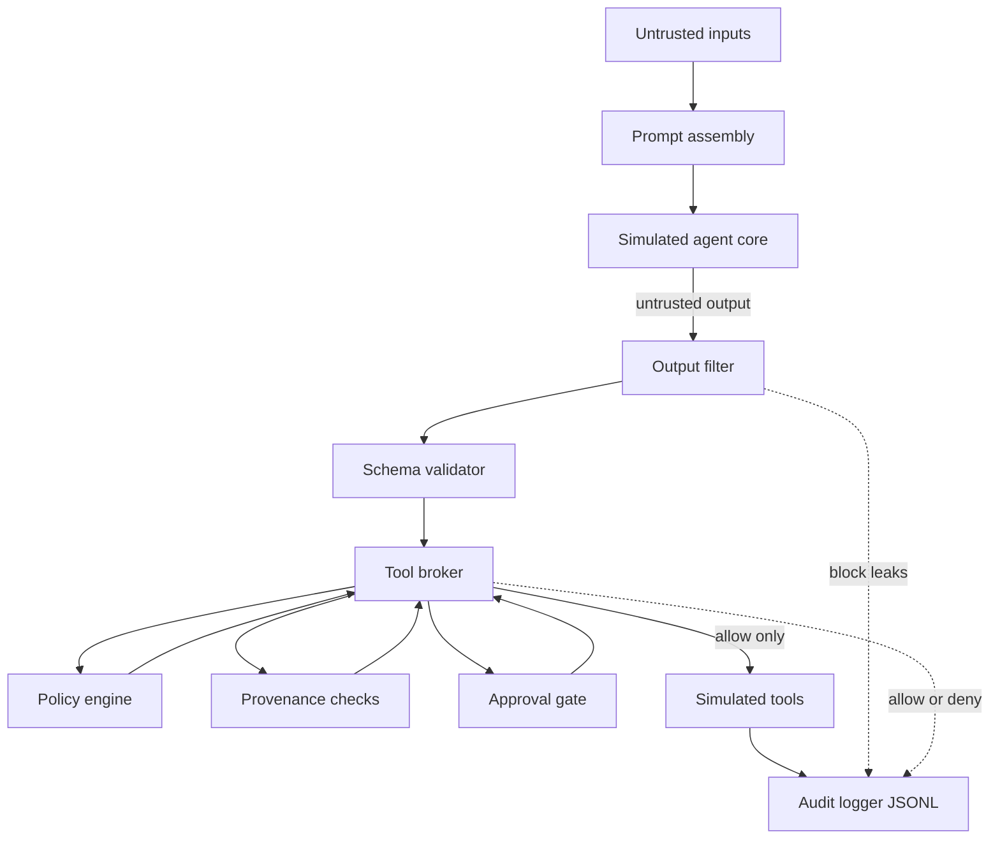
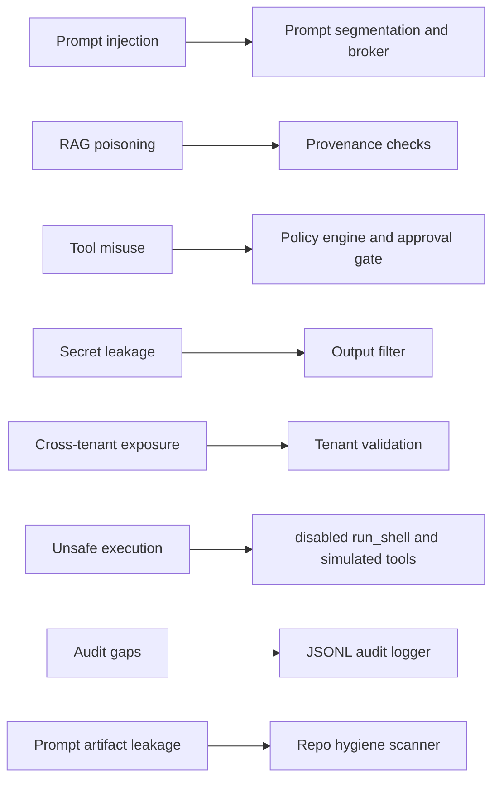
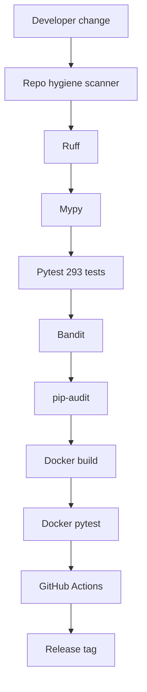

<p align="center">
  
</p>

<p align="center">
  <strong>Production-oriented defensive reference implementation for securing tool-connected LLM agents.</strong>
</p>

# llm-agent-control-plane

[](https://github.com/codethor0/llm-agent-control-plane/actions/workflows/ci.yml)
[](https://github.com/codethor0/llm-agent-control-plane/releases)
[](https://www.python.org/downloads/release/python-3120/)
[](LICENSE)
[](https://github.com/codethor0/llm-agent-control-plane/actions)
[](SECURITY-CONTROLS.md)
[](Dockerfile)

Production-oriented defensive reference implementation for securing tool-connected LLM agents with an **external control plane**.

**Core idea:** LLM agents may propose actions, but only the external control plane can authorize them.

This repository is a **local, simulated** demonstration. It shows how to keep authorization, policy, provenance checks, human approval, output filtering, and audit logging **outside** the model. It is intended for security engineers, defenders, and builders learning control-plane patterns.

**Boundary:** This is not a drop-in production service yet. Production deployment still requires identity, persistence, key management, enterprise DLP, observability, deployment hardening, and operational review.

## Publication status

| Item | Status |
|------|--------|
| Repository | https://github.com/codethor0/llm-agent-control-plane |
| CI | GitHub Actions on `main` (badge above); supply-chain: CodeQL, Gitleaks, Trivy, SBOM; tag releases get unsigned `SHA256SUMS` (see [release provenance](docs/release-provenance.md)) |
| Latest release | [v0.3.0](https://github.com/codethor0/llm-agent-control-plane/releases/tag/v0.3.0) (clean public history and release readiness) |

## One-command quick start

Requires **Python 3.12** (see [Python version](#python-version)).

```bash
make setup && make demo
```

Full validation (including Docker when the daemon is running):

```bash
make setup && make validate
```

## Python version

| Environment | Python |
|-------------|--------|
| Project target | **3.12.x** (`requires-python = >=3.12,<3.13`) |
| Docker / GitHub Actions | 3.12 |
| Local host on 3.14+ | **Mismatch** — use `pyenv install 3.12`, `asdf`, or Docker |

Verify your venv:

```bash
.venv/bin/python scripts/check_python_version.py
```

## Docker quick start

```bash
docker compose build
docker compose run --rm app python -m pytest
make demo
```

Production-oriented reference Compose profile (fake secrets only):

```bash
docker compose -f docker-compose.production.yml build
docker compose -f docker-compose.production.yml up
```

See [docs/deployment-checklist.md](docs/deployment-checklist.md) and `.env.production.example`.

### Docker troubleshooting

| Symptom | Action |
|---------|--------|
| `Cannot connect to the Docker daemon` | Start Docker Desktop or the system Docker service, then retry `docker compose build`. |
| Build fails on `pip install` | Ensure network access; rebuild with `docker compose build --no-cache`. |
| Tests differ from host | Docker runs the image copy of the code (no bind mounts). Rebuild after changes. |

Docker validation is **not** claimed unless `docker compose build` and `docker compose run --rm app python -m pytest` succeed on your machine.

## What this repo does

- Demonstrates a deterministic **external control plane** around a simulated LLM agent
- Enforces **deny-by-default** policy, **tool broker** authorization, **provenance** rules, **human approval**, and **output filtering**
- Writes structured, **redacted JSONL** audit events
- Provides a local **FastAPI** API and **CLI demo**
- Maps [security invariants](docs/defensive-controls.md) to **293** automated tests
- Exposes a safe [LLM adapter interface](docs/llm-adapter.md) (simulated by default; no live API calls)
- Provides [audit taxonomy](docs/audit-event-taxonomy.md), [SIEM export guidance](docs/siem-export.md), and [operator playbooks](docs/audit-review-playbook.md) for review and response
- Ships [deployment reference profiles](docs/deployment-boundaries.md) (Compose, Kubernetes manifests, checklists; not a managed platform)
- Blocks prompt artifacts from the repository via `scripts/validate_repo.py`

## What this repo does not do

- Call production LLM APIs by default
- Execute real shell commands, send real email, or scan networks
- Store or exfiltrate real credentials
- Provide exploit chains, jailbreak libraries, or offensive tooling
- Test or attack third-party systems
- Guarantee safety for production deployments

## Architecture

**Core idea:** LLM agents may propose actions, but only the external control plane can authorize them. Model output is untrusted; the tool broker is the authority boundary for policy, provenance, approval, and simulated execution.

Detailed diagrams: [docs/architecture.md](docs/architecture.md). Threat framing: [docs/threat-model.md](docs/threat-model.md). Optional exported assets: [SVG](docs/assets/llm-agent-control-plane.svg), [PNG](docs/assets/llm-agent-control-plane.png).

### End-to-end control plane (protected path)



### Security zones

```mermaid
flowchart LR
  subgraph untrusted["Untrusted zone"]
    u1[User input]
    u2[Retrieved documents]
    u3[Tool output]
    u4[Model output]
  end

  subgraph boundary["Deterministic control boundary"]
    b1[Schema validation]
    b2[Tool broker]
    b3[Policy engine]
    b4[Provenance checks]
    b5[Approval gate]
    b6[Output filter]
  end

  subgraph execution["Execution and evidence zone"]
    e1[Simulated tools]
    e2[JSONL audit logs]
    e3[Demo and API results]
  end

  untrusted --> boundary
  boundary --> execution
```



### Threat-to-control map



### Validation pipeline



Vulnerable path (`path=vulnerable`): skips the control boundary for labeled unsafe simulation only (no real execution). See [docs/architecture.md](docs/architecture.md#paths).

## Demo scenarios

| Scenario | Protected path |
|----------|----------------|
| `safe_read` | Allowed (simulated read) |
| `internal_reviewed_read` | Allowed (internal reviewed provenance) |
| `shell_attempt` | Blocked (`run_shell` disabled) |
| `injection_send_email` | Blocked (retrieved provenance) |
| `send_email_approved` + `human_approval=true` | Allowed |
| `output_secret_leak` | Blocked (output filter) |
| `export_no_approval` | Blocked (approval gate) |
| `export_approved` + `role=admin` + `human_approval=true` | Allowed |
| `cross_tenant_read` | Blocked (tenant isolation) |

Vulnerable path (`path=vulnerable` on `/run`): simulates unsafe decisions **without** broker enforcement (still no real execution).

```bash
make demo
```

## Validation matrix

| Check | Command | Notes |
|-------|---------|-------|
| All checks | `make validate` | lint, types, 293 tests, repo hygiene, policy integrity, bandit, pip-audit, Docker |
| Tests | `python -m pytest` | 293 security-focused tests (includes enterprise doc honesty, release provenance, deployment artifacts) |
| Repo hygiene | `python scripts/validate_repo.py` | Blocks prompt artifacts |
| Policy integrity | `python scripts/validate_policy.py` | Schema, invariants, SHA-256 vs `policies/default.sha256` |
| Demo | `make demo` | Seven CLI scenarios |
| Supply chain (CI) | CodeQL, Gitleaks, Trivy, SBOM; checksums on tag | See [docs/supply-chain.md](docs/supply-chain.md); checksums are not signatures |

## API example

```bash
source .venv/bin/activate
uvicorn agent_control_plane.api:app --reload --port 8080
```

```bash
curl -s -X POST http://127.0.0.1:8080/run \
  -H 'Content-Type: application/json' \
  -d '{
    "request_id": "demo-1",
    "user_id": "user-1",
    "session_id": "sess-1",
    "tenant_id": "tenant-a",
    "role": "user",
    "user_message": "Read my records",
    "scenario": "safe_read",
    "path": "protected"
  }'
```

## Security principles

- Deny by default.
- Treat model output as untrusted.
- Keep authorization outside the model.
- Use the broker as the authority boundary.
- Treat schema validation as input validation, not authorization.
- Require provenance and approval checks for sensitive actions.
- Filter and audit outputs outside the model.
- Simulate tools in this reference implementation.

Security controls matrix: [SECURITY-CONTROLS.md](SECURITY-CONTROLS.md). Invariants: [docs/defensive-controls.md](docs/defensive-controls.md). Threat model: [docs/threat-model.md](docs/threat-model.md).

## Safe use

Use only in **authorized local lab** environments. Do not point this project at production systems, real customer data, or third-party targets. Report issues per [SECURITY.md](SECURITY.md).

For deployment guardrails (API auth, CORS, request limits, container profile), see [docs/production-hardening.md](docs/production-hardening.md) and [docs/deployment-threat-model.md](docs/deployment-threat-model.md). Production mode improves posture but does **not** make this a certified production service.

## Contributing and roadmap

- [CONTRIBUTING.md](CONTRIBUTING.md) — tests required for security changes
- [ROADMAP.md](ROADMAP.md) — planned future work
- [docs/release-checklist.md](docs/release-checklist.md) — pre-release validation
- [docs/release-security-checklist.md](docs/release-security-checklist.md) — supply-chain release gates
- [docs/release-provenance.md](docs/release-provenance.md) — release trust model (unsigned limitations)
- [docs/artifact-verification.md](docs/artifact-verification.md) — verify tags, CI, SBOM, checksums
- [docs/supply-chain.md](docs/supply-chain.md) — CodeQL, Gitleaks, Trivy, SBOM, Dependabot
- [docs/github-actions-trust.md](docs/github-actions-trust.md) — Actions pinning and maintenance
- [docs/enterprise-integration-plan.md](docs/enterprise-integration-plan.md) — enterprise IdP, KMS, SIEM, approvals (guidance only)
- [docs/enterprise-readiness-checklist.md](docs/enterprise-readiness-checklist.md) — operator readiness gates
- [docs/branch-protection.md](docs/branch-protection.md) — recommended `main` protection (guidance)
- [docs/production-hardening.md](docs/production-hardening.md) — deployment profile and checklist
- [docs/deployment-threat-model.md](docs/deployment-threat-model.md) — deployment threats and mitigations
- [docs/github-publication-readiness.md](docs/github-publication-readiness.md) — first push checklist
- GitHub issue templates under `.github/ISSUE_TEMPLATE/`

## Configuration

Copy `.env.example` to `.env` (optional). Policy: `policies/default.yaml`.

## License

MIT — [LICENSE](LICENSE).
