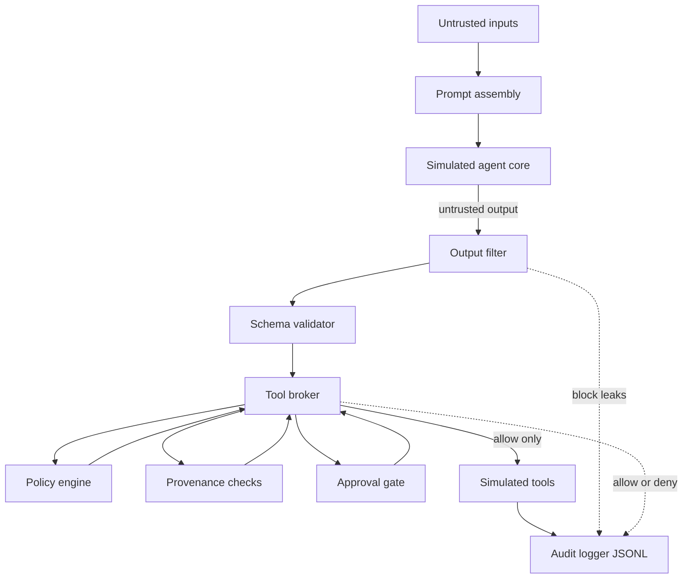
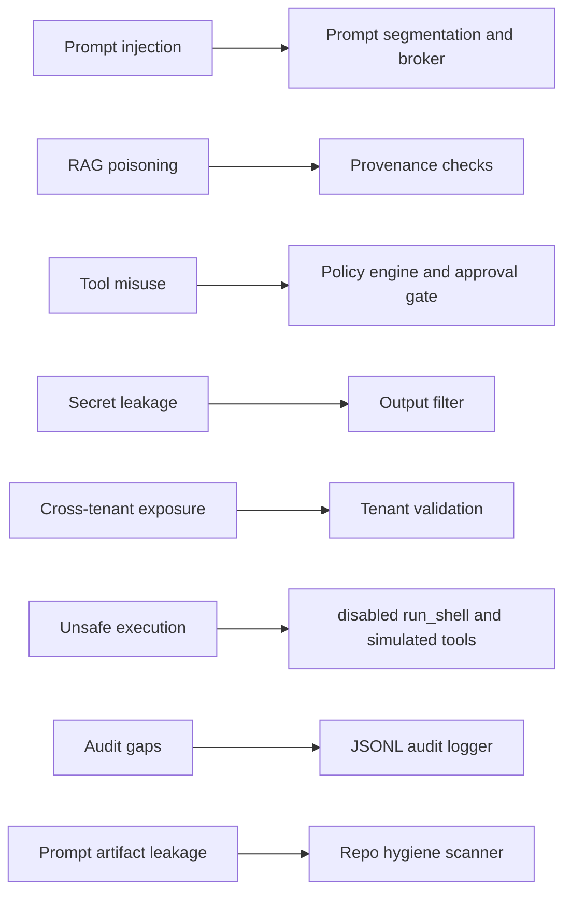
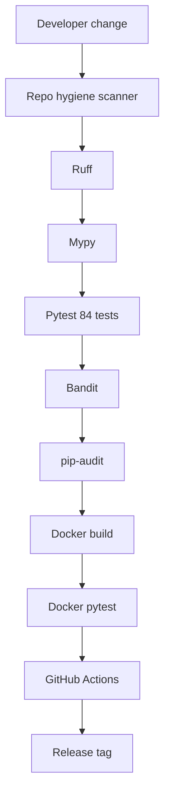
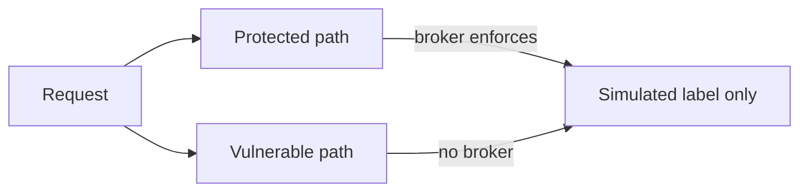

# Architecture

## Overview

This lab implements an **external control plane** around a simulated LLM agent. The model may propose tool calls; only the tool broker (policy, provenance, and approval gate) may authorize execution. All tools run through a local simulator.

**Core idea:** The model can ask. The broker decides.

Diagrams below use Mermaid (GitHub-rendered). Optional static exports: [llm-agent-control-plane.svg](assets/llm-agent-control-plane.svg), [llm-agent-control-plane.png](assets/llm-agent-control-plane.png).

## End-to-end control plane

**What it shows:** The protected path from untrusted input to simulated tool execution and audit logging.

**Security boundary:** Everything after the simulated agent core is deterministic enforcement. Schema validation checks structure only; the tool broker is the authority boundary for allow or deny.

**What is simulated:** The agent core and all tool effects. No production LLM API, shell, email, or network calls.

| Stage | Module | Owns the decision? |
|-------|--------|--------------------|
| Prompt assembly | `prompt.py` | No — context only |
| Simulated agent core | `agent_core.py` | No — proposes text and tool calls |
| Output filter | `output_filter.py` | Yes — blocks secret patterns |
| Schema validator | `schemas.py` / broker | Structure only, not authorization |
| Tool broker | `tool_broker.py` | Yes — authority boundary |
| Policy engine | `policy_engine.py` | Yes — deny by default, roles, tenant |
| Provenance checks | `provenance.py` | Yes — source cannot authorize alone |
| Approval gate | `approval_gate.py` | Yes — high-impact tools need approval |
| Simulated tools | `simulator.py` | Simulated effects only |
| Audit logger | `audit_logger.py` | Evidence — redacted JSONL |

## Security zones

**What it shows:** Separation between untrusted content, deterministic controls, and simulated execution plus audit evidence.

```mermaid
flowchart LR
  subgraph untrusted["Untrusted zone"]
    u1[User input]
    u2[Retrieved documents]
    u3[Tool output]
    u4[Model output]
  end

  subgraph boundary["Deterministic control boundary"]
    b1[Schema validation]
    b2[Tool broker]
    b3[Policy engine]
    b4[Provenance checks]
    b5[Approval gate]
    b6[Output filter]
  end

  subgraph execution["Execution and evidence zone"]
    e1[Simulated tools]
    e2[JSONL audit logs]
    e3[Demo and API results]
  end

  untrusted --> boundary
  boundary --> execution
```

Nothing in the untrusted zone may authorize privileged tools. The broker must approve before the simulator runs.

## Threat-to-control map

**What it shows:** Why each control exists. Maps to [defensive-controls.md](defensive-controls.md) and [SECURITY-CONTROLS.md](../SECURITY-CONTROLS.md).

## Validation pipeline

**What it shows:** How the project earns confidence on each change. Same steps as `make validate` and GitHub Actions.

## Paths

| Path | Behavior |
|------|----------|
| **Protected** | Full pipeline: filter, schema, broker, policy, approval, simulation, audit |
| **Vulnerable** | Skips broker/policy; records labeled unsafe simulation only |

## Modules

| Module | Role |
|--------|------|
| `prompt.py` | Assembles prompts; does not grant authority |
| `agent_core.py` | Deterministic simulated model output |
| `schemas.py` | Pydantic argument shapes |
| `tool_broker.py` | Authority boundary |
| `policy_engine.py` | YAML policy evaluation |
| `approval_gate.py` | Human approval gate (wired in broker) |
| `provenance.py` | Declarative provenance rules |
| `output_filter.py` | Blocks secrets, keys, JWT-like tokens, blobs |
| `audit_logger.py` | JSONL audit with redaction |
| `simulator.py` | Safe simulated tools |
| `pipeline.py` | Orchestration |
| `api.py` | FastAPI local demo |

## Trust boundaries

- **Trusted:** static policy file, broker code, output filter, audit redaction logic
- **Untrusted:** user messages, retrieved chunks, all model output including tool calls

## Provenance

See [provenance.md](provenance.md). Provenance is declarative metadata today, not signed attestation.

## Non-goals

- Real LLM API integration
- Real shell, email, or network execution
- Multi-tenant production isolation beyond demonstration checks
